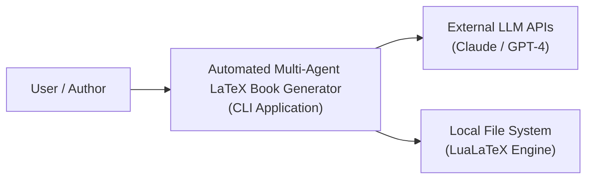
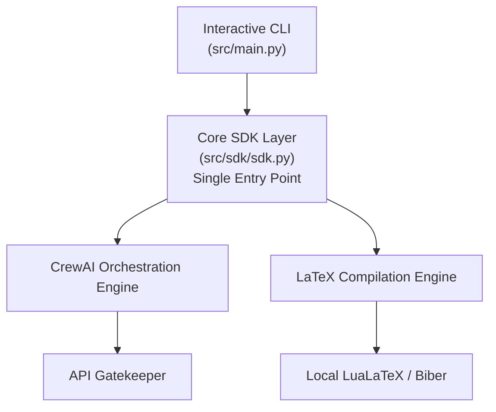
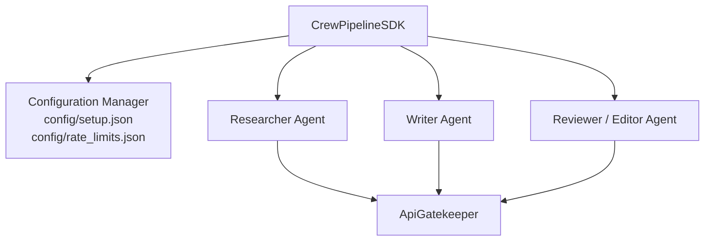
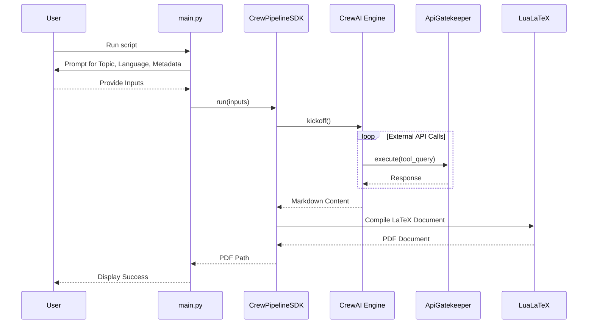
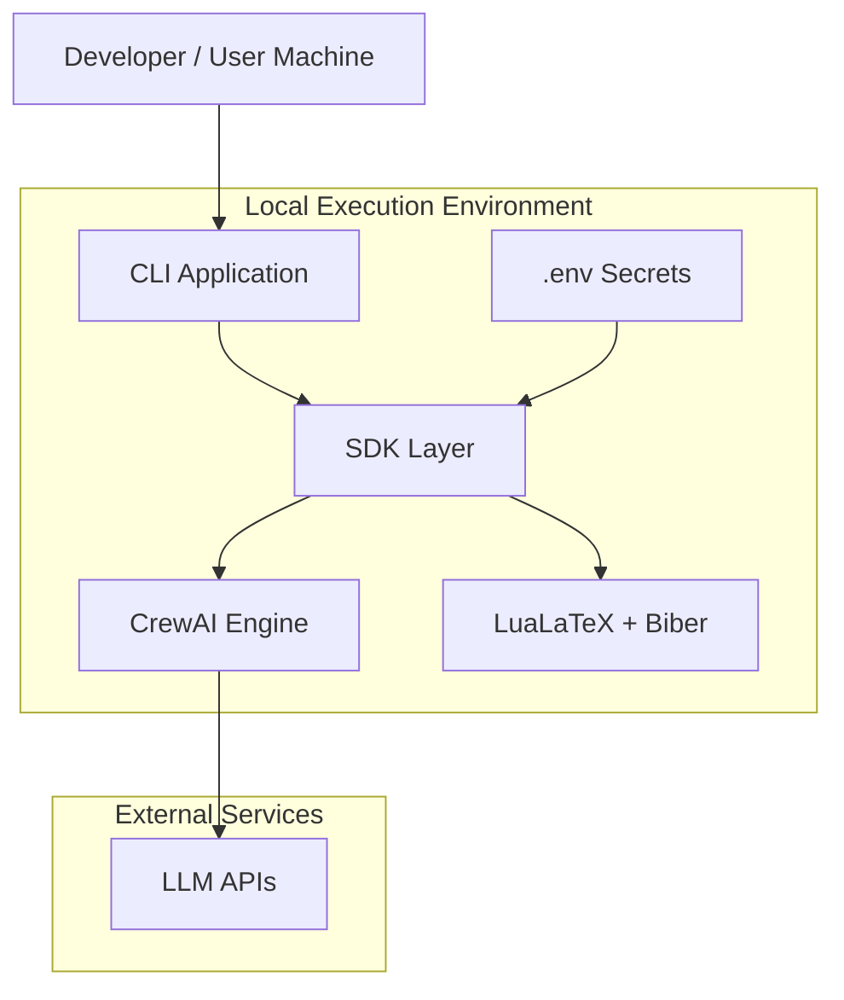

````md
# Architecture and Technical Plan (`docs/PLAN.md`)

This planning document describes the architecture and technical design of the project. It details the structural breakdown of the system using C4 Model diagrams (Context, Container, Component, Code), visualizes complex workflows through UML and deployment diagrams, establishes Architectural Decision Records (ADRs) with their rationale and trade-offs, and documents the core API data schemas and contracts.

---

## 1. C4 Model Diagrams

The system architecture is modeled using the C4 framework (Context, Container, Component, Code) to provide hierarchical abstractions of the software design.

### 1.1 System Context Diagram

The Context level illustrates how the user and external systems interact with the Automated Multi-Agent LaTeX Book Generator.



### 1.2 Container Diagram

The Container level breaks down the main application into its execution layers, strictly enforcing the rule that all business logic flows through a centralized SDK.



### 1.3 Component Diagram

The Component level focuses on the internal structure of the CrewAI orchestration engine and the Core SDK layer.



#### Component Responsibilities

- **`CrewPipelineSDK`**: Exposes a `.run()` method and coordinates the complete pipeline lifecycle.
- **Researcher Agent**: Performs scoped research and information gathering based on the selected topic.
- **Writer Agent**: Produces structured Markdown content in the selected language mode.
- **Reviewer Agent**: Verifies quality, formatting consistency, and LaTeX compatibility.
- **Configuration Manager**: Loads and validates application configuration and rate-limit policies.
- **`ApiGatekeeper`**: Wraps all external requests and enforces retry policies, queuing, and backpressure handling.

### 1.4 Code Diagram (Class Structure)

The Code level defines the strict object-oriented implementations for the SDK and Gatekeeper.

```python
class ApiGatekeeper:
    """Centralized API call manager."""

    def __init__(self, config: dict):
        # Initializes with rate limits loaded from config
        pass

    def execute(self, api_call, *args, **kwargs):
        # Checks rate limits, queues requests if necessary,
        # and executes the call
        pass


class CrewPipelineSDK:
    """Single entry point for all application logic."""

    def __init__(self):
        self.gatekeeper = ApiGatekeeper(load_config())

    def run(self, inputs: dict) -> str:
        # Instantiates CrewAI process,
        # executes tasks,
        # returns generated PDF path
        pass
```

---

## 2. UML Diagrams & Deployment

To clarify complex processes, the following UML sequence diagrams and deployment outlines are provided.

### 2.1 UML Sequence Diagram: Execution Flow

This UML process outlines the interactive user flow and internal agent orchestration.



### 2.2 Deployment Architecture



#### Deployment Notes

- **Environment:** Local execution environment managed with `uv`.
- **Runtime Requirements:** Python 3.10+, `uv`, and a local installation of TeX Live or MiKTeX.
- **Compilation Tools:** `lualatex` and `biber`.
- **Secrets Management:** API credentials are stored in `.env` files and loaded through environment variables. Secrets are never committed or distributed with application artifacts.

---

## 3. Architectural Decision Records (ADRs)

These records track significant architectural choices, including the rationale behind them and the accepted trade-offs.

### ADR 1: Centralized SDK Architecture

#### Context

The application requires a modular structure that separates user interfaces (CLI) from business logic.

#### Decision

Implement an SDK layer (`src/sdk/sdk.py`) as the single entry point for all application operations.

#### Rationale

This prevents business logic from leaking into the presentation layer (`main.py`) and provides a stable integration surface.

#### Trade-offs

Introduces a small amount of boilerplate due to data transfer between the CLI layer and SDK layer.

---

### ADR 2: API Gatekeeper for Rate Limiting

#### Context

Agentic pipelines can generate bursts of requests that exceed provider rate limits.

#### Decision

All outgoing LLM and HTTP requests must be routed through an `ApiGatekeeper`.

#### Rationale

Centralized enforcement of rate limits, retry policies, queueing behavior, and backpressure mechanisms.

#### Trade-offs

Execution time may increase when requests are intentionally throttled.

---

### ADR 3: Interactive Dynamic Prompting vs. CLI Arguments

#### Context

The application requires multiple user inputs including topic, language selection, and metadata.

#### Decision

Use interactive prompts instead of mandatory command-line flags.

#### Rationale

Improves usability and reduces dependency on memorizing CLI syntax.

#### Trade-offs

Non-interactive automation requires piped input, configuration files, or mocked stdin.

---

## 4. API Documentation, Data Schemas, and Contracts

Defining clear interfaces and schemas ensures stable communication between the CLI, SDK, orchestration, and compilation layers.

### 4.1 User Input Schema (Configuration Contract)

When `main.py` passes data to the SDK, it must conform to the following schema:

| Field | Type | Requirement | Description |
|---------|---------|---------|---------|
| `topic` | String | Required | Subject matter researched and written by the agents |
| `language` | Enum | Required | `english` or `bidi` |
| `author` | String | Optional | Author name shown on cover page |
| `date` | String | Optional | Submission date |
| `course` | String | Optional | Course name |
| `lecturer` | String | Optional | Lecturer name |

### Example Payload

```json
{
  "topic": "Quantum Computing",
  "language": "english",
  "author": "Jane Doe",
  "date": "2026-06-01",
  "course": "CS-701",
  "lecturer": "Dr. Smith"
}
```

### 4.2 Application Contracts

#### SDK Contract

```python
CrewPipelineSDK.run(inputs: dict) -> str
```

**Pre-condition**

- Input data has already been validated by the CLI layer.

**Post-condition**

- Returns the absolute path to the generated PDF document.

#### Gatekeeper Contract

```python
ApiGatekeeper.execute(
    api_call: Callable,
    *args,
    **kwargs
) -> Any
```

**Pre-condition**

- `api_call` is executable and conforms to expected request interfaces.

**Post-condition**

- Rate limits are enforced transparently.
- Retries and queueing are handled automatically.
- The exact response from the external service is returned.
````
